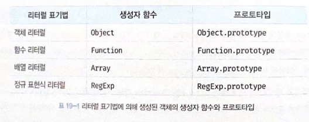

# 19장 프로토타입(2024.07.03(수))

### 19.4 리터럴 표기법에 의해 생성된 객체의 생성자 함수와 프로토타입

```
const obj = new Object(); // 생성자 함수로 생상한 객체

const objLiteral = {}; // 객체 리터럴로 생성한 객체
```

obj의 생성자 함수는 Object.<br/>
objLiteral의 생성자 함수도 Object로 동일하나 엄밀히 따지면 Object의 생성자 함수가 생성한 객체가 아님.<br/>
하지만 리터럴 표기법에 의해 생성된 객체도 상속을 위해 프로토타입이 필요 => 가상적인 생성자 함수를 가져야함 => 프로토타입, 생성자 함수가 더불어 생성<br/>
- **프로토타입과 생성자 함수는 단독으로 존재할 수 없고 언제나 쌍으로 존재함.**

But 본질적으로 면에서 차이가 없고 객체로서 동일한 특성을 갖음.<br/>
두 객체의 생성자 함수는 동일하다고 생각해도 큰 무리는 없음.<br/>


---

### 19.5 프로토타입의 생성 시점

- 프로토타입은 생성자 함수가 생성되는 시점에 더불어 생성됨
- 생성자 함수는 이하 2가지로 나눔
  - 사용자 정의 생성자 함수
  - 빌트인 생성자 함수

1. 사용자 정의 생성자 함수의 경우,

- 함수 정의가 평가되어 함수 객체를 생성하는 시점에 프로토 타입도 더불어 생성 
    - 즉, 호이스팅 되서 `런타임 이전`에 평가됨
- 참고로 화살표 함수로 선언한 생성자 함수는 생성자 함수가 아니라서 프로토타입이 생성되지 않음

2. 빌트인 생성자 함수의 경우,

- 모든 빌트인 생성자 함수는 전역 객체가 생성되는 시점에 생성됨. 
    - 전역 객체 : js 코드가 실행되기 이전 단계에 js 엔진에 의해 생성됨
- 프로토타입은 마찬가지로 생성자 함수가 생성 될 때 생성됨
