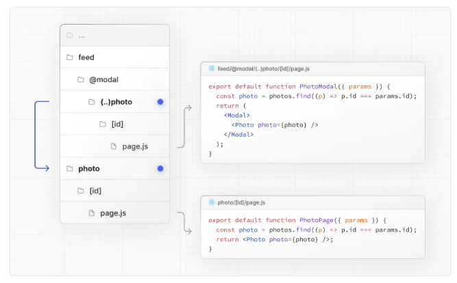

1. 동적 라우트 세그먼트를 정적으로 생성할 때는 어떤 함수를 쓰고, 이 함수의 좋은 점을 설명해주세요.

2. Parallel Routes가 사용되기 좋은 예시를 알려주세요.

3. 다음은 feed/@modal/(..)photo/[id]/page.js 에서 photo/[id]/page.js 에 있는 컴포넌트를 가로챈 모습입니다. 어떤 방법으로 인해 가로챈 것일까요?

